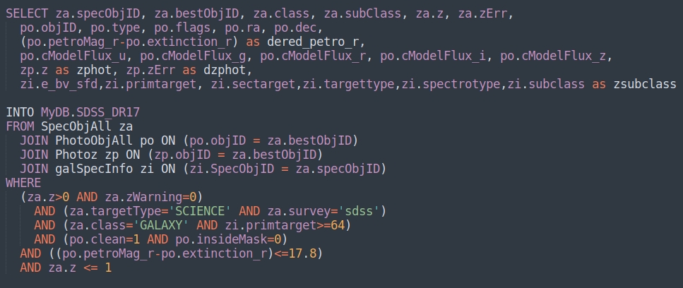
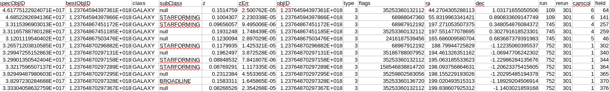

.. _data-downloading-overview:
*************************
Data Downloading Overview
*************************

In the paper I'm still working on replicating `Pasquet et al <https://arxiv.org/abs/1806.06607>`_, their main architecture is for 500,000+ galaxies, with them mentioning a smaller architecture that did fairly well on 10,000 galaxies. Due to hardware and time constraints, I chose the smaller dataset size, which still totalled to 80GB of compressed raw data.

The tabular data and the image files are all available through the Sloan Digital Sky Survey (SDSS). They have a number of ways of acquiring both forms of data, though for bulk image data downloads, the recommendation is to use wget.

I needed to create a list of all the objects I wanted in this dataset and from the information in that list, grab all of the images in the five filter bands I was interested in for each object (which are galaxies in this case). This involved submitting an SQL query to the `CasJobs <https://skyserver.sdss.org/CasJobs/>`_ site. I used a different data release than the paper I'm (loosely) replicating and had different criteria for redshift range, number of objects that I could train on, and need to randomize the order. However, the database schema stayed relatively similar between the original paper and the data release I used (DR17 instead of DR12), so most of the query remains very similar to the original publish query.

Once I had the results of that, I downloaded the database as a CSV and pushed it to my own S3 bucket. With a secure endpoint for these calculations, to make sure everything was perfectly repeatable (I have set seeds for everything), I wrote a S3 target task for luigi and a downloader for the tabular data (the results of the query).

Above you can see a snippet of the tabular data. LibreOffice Calc isn't doing a great job of parsing the file, but pandas did everything correctly. From the columns camcol, field, and rerun, you can determine which FITS image the observation is in and grab each observation from formatting like this:
f"https://data.sdss.org/sas/dr17/eboss/photoObj/frames/{row.rerun}/{row.run}/{row.camcol}/frame-{band}-{str(row.run).zfill(6)}-{row.camcol}-{str(row.field).zfill(4)}.fits.bz2\n"

Calling wget on that url will get you the right file. I generated a temporary file name based on the hash of the formatted url and told wget to download the file to that temp name, then when it was done, atomically "move" the file to its final name. I wrapped everything in a try except so it would continue if it ran into errors, since each downloading task is reponsible for downloading thousands of files.

I also check to make sure that if the file already exists, not to download it. If the downloading failed, and the temporary file got deleted, I also tell luigi to re-attempt downloading.
