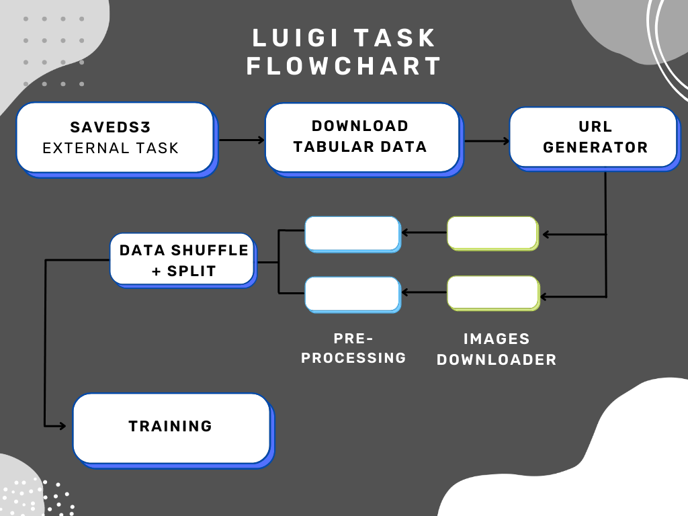

.. Photometric Redshifts documentation master file, created by
   sphinx-quickstart on Tue May 10 00:34:41 2022.
   You can adapt this file completely to your liking, but it should at least
   contain the root `toctree` directive.

Welcome to Photometric Redshifts's documentation!
=================================================

For project intro, please click here: :ref:`project-intro`

As a quick overview of the luigi tasks involved:

Data Downloading: :ref:`data-downloading-overview`

Preprocessing: :ref:`preprocessing-overview`

Salted: :ref:`salted`

Training: :ref:`training`

.. toctree::
   :maxdepth: 2
   :caption: Contents:

   modules

Indices and tables
==================

* :ref:`genindex`
* :ref:`modindex`
* :ref:`search`

.. automodule: final_project
