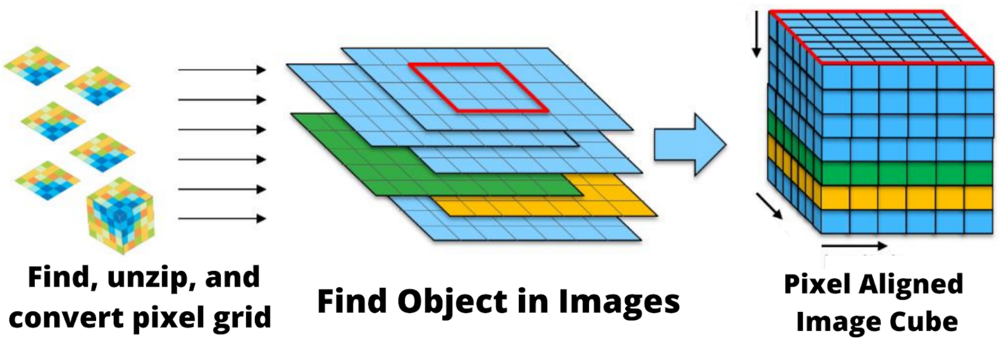
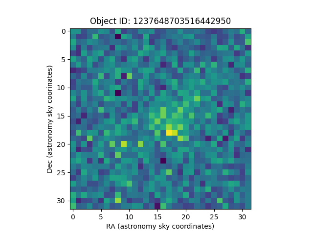
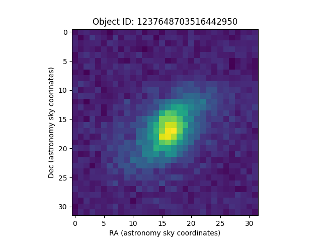
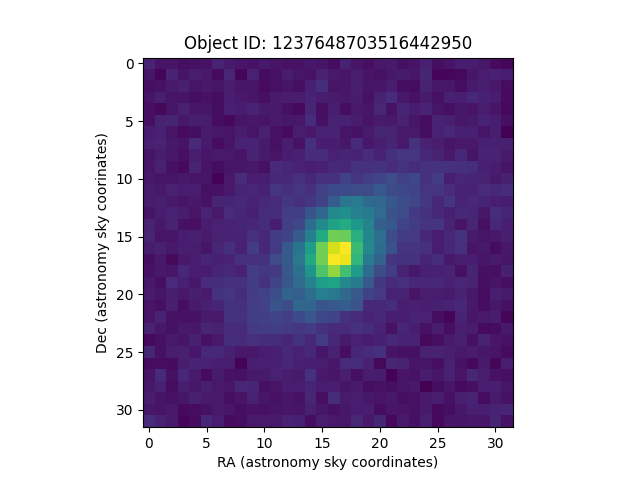
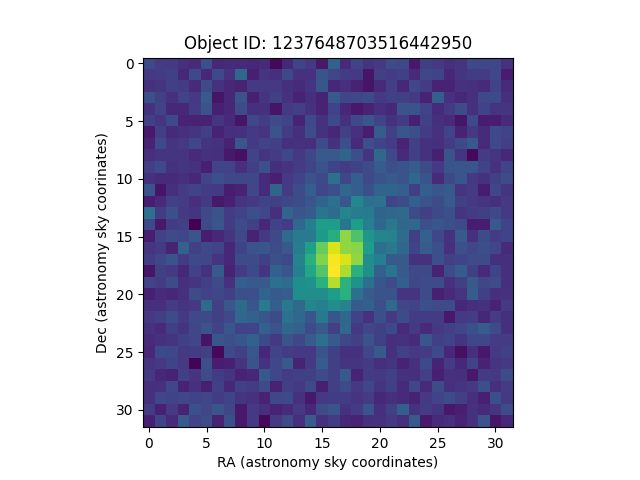

.. _preprocessing-overview:
**********************
Preprocessing Overview
**********************

After downloading the five images (called FITS images, the file format used in astronomy) for each observation, there was about 80GB of *compressed* (180GB uncompressed) raw data.

The preprocessing looked like above: reading in the zipped file with the built-n bz2 library, opening the image with astropy's file handing functions, then determining the pixel grid and sky coordinates from this image using astropy's WCS module, which uses the metadata in every FITS image to determine exactly what part of the sky each pixel in the image corresponds to.

That makes it straightforward to convert from knowing where something is in the sky to where it is in your image. I used that process to center a (32, 32) square on the object in each of the five image frames & crop.

There were a number of challenges I ran into in this step:

- Despite the safeguards in ImageDownloader, empty files still get saved to disk occasionally, so I would get an OSError when starting the preprocessing step.

- There were a few observations in the tabular data that were not downloaded. Either the SDSS didn't actually have the image corresponding to the tabular data entry or it was stored on a different part of their database. Since this was only a handful of files, I elected to skip them and build in error handling for FileNotFound.

I wrapped the preprocessing in a try except for the two errors I expected to occur and log the files that cause those errors.

I also had to decide how the multi-processing was going to work here, as I had finished writing the ImageDownloader that could be run with an arbitrary number of workers, only depending on your computer's hardware. I talked with AJ about this and decided on having a one-to-one relationship between an ImageDownloader worker/instance and a Preprocessing worker/instance. For each coupled set, they are responsible for a range of observations and the corresponding five images per each of those observations.

Here is an example of what each datacube looked like after all the pre-processing steps, noting that each image is the same object photographed in a different filter band (ie, green, ultraviolet, etc):

