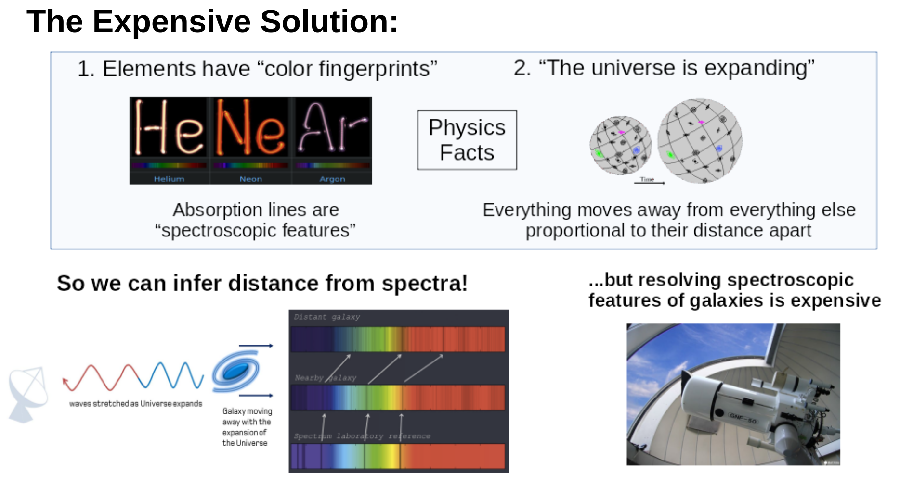

.. _project-intro:
Project Intro
=============
*************
Project Intro
*************

I used Luigi and salted graphs for data extraction, preprocessing, and experimentation while I replicated (and modified) the smaller architecture from this paper: `Photometric redshifts from SDSS images using a Convolutional Neural Network <https://arxiv.org/abs/1806.06607>`_. I also reference this one quite a lot in my discussion: `Investigating Deep Learning Methods for Obtaining Photometric Redshift Estimations from Images <https://arxiv.org/abs/2109.02503v1>`_.

.. I'm replicating the smaller architecture from the first, and the idea of using a mixed-input model from the second.
The overall goal of the project is to produce an automated pipeline for training models to produce distance estimations of galaxies from photos in a learned approach. Below is a quick overview of the science behind why this is possible.

Problem Background
##################
How far away is this galaxy?

In astronomy, until we develop light speed engines, we're almost entirely limited to estimating this by only cameras. It's a surprisingly hard task that's far from solved.

It also underpins every aspect of research. From determining the age of the universe and resolving crises in fundamental physics to being able to calibrate solar convection models, it impacts *everything*.

Astronomers have developed a variety of methods, used for different distances and different situations, but we will talk about the most
accurate and its learned approximation.

This method is called spectroscopic redshift. Spectroscopic, meaning it looks at the spectrum, and redshift, the distance to the galaxy. We're all familiar with Doppler Shift, as we experience it every time an ambulance passes us on the street. It describes how waves, sound or light, get stretched out or compressed as objects move relative to each other. And galaxies are, unfortunately and fortunately, all moving away from us. This is because the universe itself is expanding, and like ants on a balloon being blown up, ants/galaxies farther away from us appear to moving faster away than nearby ants.

With expansion, the light from galaxies is being stretched out, and the farther away from us, the more their light has been stretched out. This stretching out of light makes the whole object seem slightly redder (thus the term redshift). We can measure how the light has become stretched out, and thus how far away it is, through spectroscopy very precisely, as spectra shows us how bright the object is at every wavelength. If we know that the object will be super bright at wavelength 4268nm (for example) because it's mostly made of hydrogen and hydrogen glows very brightly at that wavelength, we can see how much that hydrogen line has shifted when we observe the object.

Unfortunately, getting spectra is a hard process that's not always possible.

The alternative is to see how bright the image via photos, which you can think of as a rough histogram of a spectrum. Spectra show brightness at every wavelength, photographs show brightness over a range of wavelengths. Astronomers use filters, like green, ultraviolet, etc to take photos in narrower wavelength bands than our phone cameras to see how bright something is over that histogram bin. Since there's still information about how the object has been "reddened" in that rough histogram, astronomers can still get a (rougher) estimate of that reddening. This process is called Photometric Redshift.

.. image:: images/problem_overview.png
  :width: 500
  :alt: Hubble Deep Field image with galaxy circled

For photometric redshifts, most astronomy pipelines today transform a cleaned image of an object in a particular filter to a single
number, magnitude/brightness, that can then be used in a machine learning approach. There are other things
calculated from these images that are used in other situations, but for redshift estimation, the work is
done with usually five or more magnitudes in different, non-overlapping filters.

Like you see in the picture above, training directly on the images has struggled to be adopted as the go-to method for estimating distances not-from-spectra. That's the motivation for this project, to built out an automated pipeline that I can continue to improve as the astronomy community finds better and better architectures for estimating redshifts from photos (I also want this pipeline to work on improving estimates myself as well!)

Definitions
############
(With hyperlinks for more information)
* `Redshift <https://en.wikipedia.org/wiki/Redshift>`_ – “distance” as measured by Doppler shift.
* `Hubble Constant <https://lweb.cfa.harvard.edu/~dfabricant/huchra/hubble/>`_ – a time varying parameter that tells us the rate of expansion of the universe at that time epoch
* `CCD <https://en.wikipedia.org/wiki/Charge-coupled_device>`_ – the camera of choice for most telescopes
* `Spectroscopic Redshift <https://en.wikipedia.org/wiki/Redshift#Observations_in_astronomy>`_ – more accurate than photometric redshifts. Distance measurements produced by fitting spectra data to a black body curve
* `Photometric Redshift <https://en.wikipedia.org/wiki/Photometric_redshift>`_ - distance measurements produced by photometric data
* `Photometric <https://en.wikipedia.org/wiki/Photometry_(astronomy)>`_ – Data produced by photos of objects. Usually taken in a filter to only capture photos in a given range of wavelengths (red, blue, green, etc).
* `SDSS <https://www.sdss.org/>`_ – Sloan Digital Sky Survey
