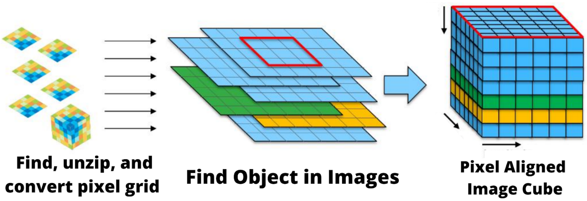

Hello! Testing, testing.

I used Luigi and salted graphs for data extraction, preprocessing, and experimentation while I replicated (and modified) the smaller architectures from these two papers: :Photometric redshifts from SDSS images using a Convolutional Neural Network:`https://arxiv.org/abs/1806.06607` and :Investigating Deep Learning Methods for Obtaining Photometric Redshift Estimations from Images:`https://arxiv.org/abs/2109.02503v1`.

I'm replicating the smaller architecture from the first, and the idea of using a mixed-input model from the second. The overall goal of the project is to produce distance estimations of galaxies from photos in a learned approach.

How far away is this galaxy?

.. image:: images/galaxy_dist.png
  :width: 300
  :alt: Hubble Deep Field image with galaxy circled

In astronomy, until we develop light speed engines, we're almost entirely limited to estimating this by only cameras. It's a surprisingly hard task that's far from solved.

It also underpins every aspect of research. From determining the age of the universe and resolving crises in fundamental physics to being able to calibrate solar convection models, it impacts *everything*.

.. image:: images/problem_overview.png
  :width: 300
  :alt: Hubble Deep Field image with galaxy circled

