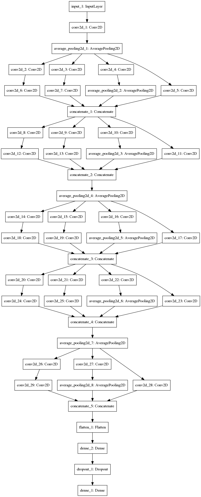

.. _training:
**********************
Training Overview
**********************

This is the section with a few kinks I still need to work out as I continue on with the project past the class. Currently, this end point of the DAG is actually just getting kicked off via cli.py with Processing instances without any requirements, though of course it depends on the rest of the graph. In the future, I would like to probably implement a MasterTask to at least handle the pipeline more robustly than in the main of cli.

There's also a bug in the translation of the model architecture from Pasquet et al in the InceptionModel class that I am still resolving.

In the presentation I mentioned that I decided to use two config files for the TrainModel task to avoid needing to make code changes to configuration parameters:

Didn’t want code to change for different parameters of the same network:
* Two config files: one to tell the model what config file to use
* The actual config file of what parameters to use (if just one, would need to change the name of the config file to use in the code for every iteration or to change the config file).
* Needed to load configs into the luigi training task as parameters with default values for the loaded configs. This resulted in some code repetition, but allowed the salt for the model training to actually depend on what made the model different for it’s essential task: Experiment tracking.

I also opted to implement a base class for the various models with cached properties, but in the future I will likely modify this to be a metaclass Factory, with dunder new (can't seem to format the actual name properly) defined to create different models based on a string passed in, so the first config file can directly tell TrainModel which parameters are going to to be used for this run *and* which kind of model to create. The below image is the architecture of the InceptionModel in training.py (from the Pasquet et al paper):

I also still have some hard-coded file names, like all my models are still be stored in "models", which I intend to switch to loading a config file for every one, but that's lower on the priority list.

For the DataGenerator, I started the process from a `popular existing implementation <https://stanford.edu/~shervine/blog/keras-how-to-generate-data-on-the-fly>`_. My processed data is still fit-able in my current hardware's RAM, but it was very nice to implement for scaling up to larger architectures, increasing modularity/robustness to future changes, and, most importantly, allowing for multiprocessing. I need to make sure that the multiprocessing is definitely thread-safe, as there's a chance my batches could overlap, especially with more and more workers (tensorflow handled ones, not luigi). This would require modifying how I generate batches, which would hopefully just mean replacing that one line in my dunder getitem with a function call with more complicated logic.

I also want to build out some more wrappers & tools for quality of life tensorflow operations - predictions, confusion matrices, etc.
